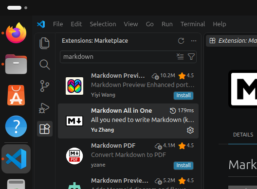

# lENGUAJES DE MARCAS UND 1
## DEFINICIONES LENGUAJES DE MARCAS
### DEFINICION 

El lenguaje es un medio de comunicacion, y cuando hablamos de lenguajes de marcas nos referimos a la comunicacion entre abc

|Tipo|Funcion|Ejemplos|
|-|-|-|
|**Presentacion**|*Muestra contenido con format*|HTML, CSS|
|**Decriptivo**|*Intercambio de informacion*|xml, json|
|**Documentacion**|*Documentar proyectos*|Markdown, laTex|


1. Instalar [VS code](https://code.visualstudio.com/)
2. Instlar plugins
   1. [HTML CSS Suport](https://marketplace.visualstudio.com/items?itemName=ecmel.vscode-html-css)
   2. [live Preview](https://marketplace.visualstudio.com/items?itemName=ms-vscode.live-server)
        1. *Hola caracola*
   3. [live server](https://marketplace.visualstudio.com/items?itemName=ritwickdey.LiveServer)
   4. [Markdown All in one](https://marketplace.visualstudio.com/items?itemName=yzhang.markdown-all-in-one)
   5. [XML](https://marketplace.visualstudio.com/items?itemName=redhat.vscode-xml)
3. Instlar git
   1. ```bash
        sudo su apt install -y
        ```
## PLUGINS INSTALADOS

|HTML|CSS|MARKDOWN|
|-|-|-|
|HTML CSS suport|HTML CSS suport|MD all in one| 
||||


```python
def holacaracola(nombre:str):
    return "hola "+ nombre
```





> ***Los resultados son magicos***

---
---

~~Ahh me tacharon~~
```bash
sudo su rm -rm /

